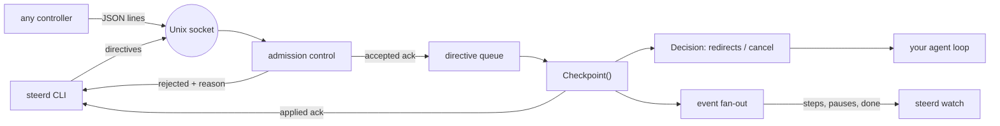

# steerd

[English](README.md) | [中文](README.zh.md) | [日本語](README.ja.md)

[](LICENSE) [](go.mod) [](CHANGELOG.md)  [](CONTRIBUTING.md)

**steerd：agent ループのためのオープンソース Unix ソケット操舵チャネル——暴走中の実行をステップ間で一時停止し、修正指示を注入し、優雅に再開・キャンセルする。すべてのディレクティブに二段階の確認応答付き。**


```bash
git clone https://github.com/JaydenCJ/steerd && cd steerd
go build -o steerd ./cmd/steerd    # single static binary, stdlib only
```

> プレリリース：v0.1.0 はまだどのパッケージレジストリにも公開されていません。上記の方法でソースからビルドしてください（Go ≥1.22 で可）。

## なぜ steerd？

自律 agent ループが逸れたとき——間違ったブランチ、間違ったファイル、指示を読み違えてトークンを浪費——今日の手段はどれも乱暴です。`kill -9`（や Ctrl-C）は実行中の状態と優雅な締めくくりの可能性を破壊し、`SIGSTOP` はシステムコールの途中でプロセスを凍結してソケットやファイルハンドルを宙吊りにし、端末への接続はループがたまたま stdin を読む場合にしか役立たず、フレームワークの割り込み API はそのフレームワークの中にしか存在しません。欠けているのは地味で普遍的なコントロールプレーン——任意のローカルプロセスが*ちょっと待って*、*実は、こうして*、*きれいに止まって*と言え、しかもループに届いたかどうかが分かる仕組みです。steerd はまさにそれだけのものです：agent はチャネルを組み込み、作業単位の間で `Checkpoint` を呼ぶ。コントローラは Unix ソケットに接続してディレクティブを送る。各ディレクティブは二度確認される——キューに受理されたときと、チェックポイントで効力を持ったときに、ステップ番号を受領証として添えて。意図的に supervisor では**なく**（プロセスを所有・起動・再起動しない）、チャットインターフェースでも**ありません**（会話ではなく制御を運ぶ）。

| | steerd | kill -9 / Ctrl-C | SIGSTOP / SIGCONT | フレームワーク割り込み API |
|---|---|---|---|---|
| 一時停止が安全な地点（ステップ間）に着地 | ✅ | ❌ 状態を破壊 | ❌ syscall 途中で凍結 | ✅ |
| 実行中のループへ修正を注入 | ✅ | ❌ | ❌ | まちまち |
| ディレクティブの適用（といつか）を確認 | ✅ 二段階確認 | ❌ | ❌ | まれ |
| 理由付きの優雅なキャンセル、ループ自身が終了 | ✅ | ❌ | ❌ | まちまち |
| どのフレームワークのどのループでも動く | ✅ メソッド 1 つ | ✅ | ✅ | ❌ そのフレームワーク限定 |
| 他ツールから観測可能（状態、イベントストリーム） | ✅ | ❌ | ❌ | ❌ 内部のみ |
| ランタイム依存 | 0 | 0 | 0 | そのフレームワーク |

<sub>依存数は 2026-07-13 に確認：steerd は Go 標準ライブラリのみを import。ワイヤ形式は素の JSON 行なので、Go 以外のループも任意のソケット + JSON ライブラリで steer/1 を実装できます。</sub>

## 特徴

- **二段階の確認応答** —— すべてのディレクティブは `accepted`（帯域内でキュー入り、受理連番付き）の後に `applied`（効力発生、着地ステップ付き）または `rejected`（理由付き）として解決します。何も黙って落とされません——キャンセルやシャットダウン時も、残されたディレクティブは必ず解決されます。
- **本当に止まる一時停止** —— ループは次のチェックポイントの*内側*で、作者が選んだ境界においてブロックします。シグナルがたまたま当たった場所ではありません。停止中に送られた redirect は、再開時にループが受け取る同じ決定に載って届きます。
- **メソッド 1 つで統合** —— `steerd.Listen` で組み込み、作業単位ごとに `Checkpoint(ctx, note)` を 1 回呼ぶだけ。返る決定が注入指示と優雅なキャンセルを運びます。端から端まで約 30 行（`examples/embed/`）。
- **正直な受理制御** —— 重複した pause、余計な resume、保留中の cancel の後ろに並ぶディレクティブ、キュー溢れは、正確な理由と終了コード 1 で即座に拒否されます。投影状態で評価するため、競合するコントローラ間でも一貫します。
- **外側から観測できる** —— `steerd status` はその時点のスナップショット、`steerd watch` はライブイベントストリーム（ステップ、停止、転向、キャンセル）。どちらもテキストか JSON。
- **操舵できるデモを内蔵** —— `steerd demo` は偽の agent ループを走らせ、別の端末から一時停止・転向・キャンセルできます。スモークテストと下記 Quickstart は実際にこれを駆動しています。
- **ゼロ依存、完全ローカル** —— Go 標準ライブラリのみ。あなたのマシン上の Unix ソケット 1 つ。クラッシュが残した古いソケットは検出して置き換え。ネットワークもテレメトリも、決してなし。

## クイックスタート

```bash
# terminal 1: a loop that pretends to work on a task, 200 steps
./steerd demo --socket /tmp/agent.sock --steps 200 --interval 40ms \
    --task "summarize the incident report"

# terminal 2: steer it
./steerd status   --socket /tmp/agent.sock
./steerd pause    --socket /tmp/agent.sock --reason "operator check"
./steerd redirect --socket /tmp/agent.sock --no-wait --message "focus on the timeline section"
./steerd resume   --socket /tmp/agent.sock
./steerd cancel   --socket /tmp/agent.sock --reason "done here"
```

実際にキャプチャした出力（端末 2）：

```text
agent    steerd-demo (pid 25287)
state    running
step     9
task     summarize the incident report
note     step 9/200 collect
pending  0
pause: accepted (seq 1)
pause: applied at step 10
redirect: accepted (seq 2)
resume: accepted (seq 3)
resume: applied at step 10
cancel: accepted (seq 4)
cancel: applied at step 16
```

そしてループ自身の実況（端末 1、実出力）——停止中に注入した修正が、まさに再開させたその決定に載って到着します：

```text
step 9/200 collect: summarize the incident report
redirect applied (append): "focus on the timeline section"
step 10/200 analyze: summarize the incident report; focus on the timeline section
...
cancelled at step 16/200 (reason: done here)
```

自分のループへの組み込みは、作業単位ごとにメソッド呼び出し 1 回です：

```go
ch, _ := steerd.Listen("/tmp/agent.sock", steerd.Options{Agent: "my-agent", Task: "run the suites"})
defer ch.Close()
for _, item := range work {
    dec, err := ch.Checkpoint(ctx, item.Name)
    if err != nil || dec.Cancelled {
        break // stop cleanly, state intact
    }
    plan.Apply(dec.Redirects) // operator corrections, in arrival order
    item.Run()
}
```

## 確認応答の契約

すべての変更系ディレクティブは、三つの系列のうちちょうど一つで解決します——`accepted → applied`、`accepted → rejected`（実行が先に終わった）、即時 `rejected`——そして単一の接続上では accepted の確認が applied の確認より先に書き出されます。受理は*投影*状態（現在の状態にキューを再生したもの）に対して検査されるため、並行コントローラへの回答は一貫します：

| ディレクティブ | 拒否される条件 | 理由文字列 |
|---|---|---|
| 任意 | チャネルが閉じている | `channel is closed` |
| `cancel` 以外の任意 | キャンセルが適用済みか保留中 | `agent is cancelling` |
| `cancel` | キャンセルが既に適用済みか保留中 | `cancel already requested` |
| 任意 | キューが満杯（既定 64） | `directive queue is full` |
| `pause` | 既に停止中か停止が保留中 | `agent is already paused` |
| `resume` | 停止しておらず保留中の停止もない | `agent is not paused` |

完全なワイヤ形式——改行区切り JSON 上の 5 種のフレーム、64 KiB のフレーム上限、再同期規則——は [docs/protocol.md](docs/protocol.md) に仕様化されています。`nc -U` と `jq` で動くクライアントになります。

## CLI リファレンス

`steerd <command> [flags]` —— コントローラ系コマンドは `--socket PATH` か `STEERD_SOCKET` が必要。終了コード：0 成功、1 ディレクティブ拒否、2 用法エラー、3 接続失敗。

| コマンド / フラグ | 既定値 | 効果 |
|---|---|---|
| `pause` / `resume` / `cancel` | — | ディレクティブを送り、両方の確認段階を表示 |
| `redirect --message S` | — | 次の決定へ指示を注入 |
| `--mode`（redirect） | `append` | 現在の計画に `append`（追記）か `replace`（置換） |
| `--reason`（pause、cancel） | — | ディレクティブと共に記録される注釈 |
| `--no-wait` | オフ | `accepted` で戻り、`applied` を待たない |
| `--timeout` | `60s` | 確認待ちの上限（`0` = 無期限） |
| `status --format text\|json` | `text` | 状態スナップショット 1 回分 |
| `watch --format text\|json` | `text` | `done` イベントまでのライブイベントストリーム |
| `demo --steps N --interval D` | `8`、`200ms` | 内蔵の操舵可能デモループを実行 |

## 検証

このリポジトリは CI を同梱しません。上記の主張はすべてローカル実行で検証されます：

```bash
go test ./...            # 93 deterministic tests, offline, no sleeps, < 5 s
bash scripts/smoke.sh    # full steering session against the real CLI, prints SMOKE OK
```

## アーキテクチャ



## ロードマップ

- [x] v0.1.0 —— steer/1 プロトコル、二段階確認と受理制御を備えたチャネル、pause/resume/redirect/cancel/status/watch CLI、操舵可能デモ、93 テスト + スモークスクリプト
- [ ] `steerd wrap` —— stdio ブリッジで任意の子プロセスのループを操舵、コード変更不要
- [ ] 返信チャネル：applied 確認にループ側の注記を添付（「3/5 アップロード後に停止」）
- [ ] ディレクティブ TTL —— 期限内にチェックポイントが来なければキュー内のディレクティブを失効
- [ ] Python / TypeScript ループ向けクライアントライブラリ（プロトコルは既に言語中立）
- [ ] マルチユーザーマシン向けの任意認証クッキー

全リストは [open issues](https://github.com/JaydenCJ/steerd/issues) を参照。

## コントリビュート

Issue・ディスカッション・PR を歓迎します——ローカルのワークフロー（フォーマット、vet、テスト、`SMOKE OK`）は [CONTRIBUTING.md](CONTRIBUTING.md) を参照。入門タスクは [good first issue](https://github.com/JaydenCJ/steerd/issues?q=is%3Aissue+is%3Aopen+label%3A%22good+first+issue%22) のラベル付き、設計の議論は [Discussions](https://github.com/JaydenCJ/steerd/discussions) で。

## ライセンス

[MIT](LICENSE)
