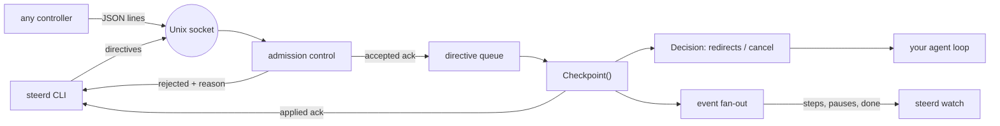

# steerd

[English](README.md) | [中文](README.zh.md) | [日本語](README.ja.md)

[](LICENSE) [](go.mod) [](CHANGELOG.md)  [](CONTRIBUTING.md)

**steerd：an open-source Unix-socket steering channel for agent loops — pause a wayward run mid-step, inject a correction, resume or cancel gracefully, with a two-stage acknowledgement for every directive.**


```bash
git clone https://github.com/JaydenCJ/steerd && cd steerd
go build -o steerd ./cmd/steerd    # single static binary, stdlib only
```

> Pre-release: v0.1.0 is not tagged on a package registry yet; build from source as above (any Go ≥1.22).

## Why steerd?

When an autonomous agent loop wanders off — wrong branch, wrong file, burning tokens on a misread instruction — today's options are all blunt. `kill -9` (or Ctrl-C) destroys in-flight state and any chance of a graceful summary; `SIGSTOP` freezes the process mid-syscall with sockets and file handles in limbo; attaching to the terminal only helps if the loop happens to read stdin; and framework-level interrupt APIs exist only inside that one framework. What is missing is a boring, universal control plane: a way for any local process to say *hold on*, *actually, do it this way*, or *stop cleanly* — and to know whether the loop heard. steerd is exactly that and nothing more: the agent embeds a channel and calls `Checkpoint` between units of work; controllers dial a Unix socket and send directives; every directive is acknowledged twice — once when it is accepted onto the queue, once when it takes effect at a checkpoint, with the step number as the receipt. It is deliberately **not** a supervisor (it never owns, starts, or restarts your process) and **not** a chat interface (it transports control, not conversation).

| | steerd | kill -9 / Ctrl-C | SIGSTOP / SIGCONT | framework interrupt APIs |
|---|---|---|---|---|
| Pause lands at a safe point (between steps) | ✅ | ❌ destroys state | ❌ freezes mid-syscall | ✅ |
| Inject a correction into the running loop | ✅ | ❌ | ❌ | varies |
| Confirms the directive was applied (and when) | ✅ two-stage ack | ❌ | ❌ | rarely |
| Graceful cancel with reason, loop exits itself | ✅ | ❌ | ❌ | varies |
| Works with any loop in any framework | ✅ one method | ✅ | ✅ | ❌ that framework only |
| Observable by other tools (status, event stream) | ✅ | ❌ | ❌ | ❌ internal |
| Runtime dependencies | 0 | 0 | 0 | the framework |

<sub>Dependency count checked 2026-07-13: steerd imports the Go standard library only; the wire format is plain JSON lines, so non-Go loops can implement steer/1 with any socket + JSON library.</sub>

## Features

- **Two-stage acknowledgements** — every directive resolves as `accepted` (queued in-band, with its admission seq) and then `applied` (took effect, with the step it landed on) or `rejected` (with a reason). Nothing is ever silently dropped — orphaned directives are resolved on cancel and shutdown too.
- **Pause that actually holds** — the loop blocks *inside* its next checkpoint, at a boundary the author chose, not wherever a signal happened to land. Redirects sent while paused ride the same decision the loop receives on resume.
- **One-method integration** — embed with `steerd.Listen` plus one `Checkpoint(ctx, note)` call per unit of work; the returned decision carries injected instructions and graceful cancellation. ~30 lines end to end (`examples/embed/`).
- **Honest admission control** — duplicate pauses, stray resumes, directives behind a pending cancel, and queue overflow are refused immediately with precise reasons and exit code 1, evaluated against the projected state so racing controllers stay coherent.
- **Observable from the outside** — `steerd status` for a point-in-time snapshot, `steerd watch` for a live event stream (steps, pauses, redirects, cancellation), both in text or JSON.
- **A steerable demo built in** — `steerd demo` runs a fake agent loop you can pause, redirect, and cancel in another terminal; the smoke test and the Quickstart below drive it for real.
- **Zero dependencies, fully local** — Go standard library only; one Unix socket on your machine, stale sockets from crashed runs are detected and replaced, no network, no telemetry, ever.

## Quickstart

```bash
# terminal 1: a loop that pretends to work on a task, 200 steps
./steerd demo --socket /tmp/agent.sock --steps 200 --interval 40ms \
    --task "summarize the incident report"

# terminal 2: steer it
./steerd status   --socket /tmp/agent.sock
./steerd pause    --socket /tmp/agent.sock --reason "operator check"
./steerd redirect --socket /tmp/agent.sock --no-wait --message "focus on the timeline section"
./steerd resume   --socket /tmp/agent.sock
./steerd cancel   --socket /tmp/agent.sock --reason "done here"
```

Real captured output (terminal 2):

```text
agent    steerd-demo (pid 25287)
state    running
step     9
task     summarize the incident report
note     step 9/200 collect
pending  0
pause: accepted (seq 1)
pause: applied at step 10
redirect: accepted (seq 2)
resume: accepted (seq 3)
resume: applied at step 10
cancel: accepted (seq 4)
cancel: applied at step 16
```

And the loop's own narration (terminal 1, real output) — the correction injected while paused arrives in the very decision that resumes it:

```text
step 9/200 collect: summarize the incident report
redirect applied (append): "focus on the timeline section"
step 10/200 analyze: summarize the incident report; focus on the timeline section
...
cancelled at step 16/200 (reason: done here)
```

Embedding into your own loop is one method call per unit of work:

```go
ch, _ := steerd.Listen("/tmp/agent.sock", steerd.Options{Agent: "my-agent", Task: "run the suites"})
defer ch.Close()
for _, item := range work {
    dec, err := ch.Checkpoint(ctx, item.Name)
    if err != nil || dec.Cancelled {
        break // stop cleanly, state intact
    }
    plan.Apply(dec.Redirects) // operator corrections, in arrival order
    item.Run()
}
```

## The acknowledgement contract

Every mutating directive resolves through exactly one of three sequences — `accepted → applied`, `accepted → rejected` (the run ended first), or immediate `rejected` — and on any single connection the accepted ack is written before the applied ack. Admission is checked against the *projected* state (current state with the queue replayed), so concurrent controllers get coherent answers:

| Directive | Rejected when | Reason string |
|---|---|---|
| any | channel closed | `channel is closed` |
| any except `cancel` | cancel applied or pending | `agent is cancelling` |
| `cancel` | cancel already applied or pending | `cancel already requested` |
| any | queue at capacity (default 64) | `directive queue is full` |
| `pause` | already paused or pause pending | `agent is already paused` |
| `resume` | not paused and no pause pending | `agent is not paused` |

The full wire format — five frame types over newline-delimited JSON, 64 KiB frame cap, resynchronisation rules — is specified in [docs/protocol.md](docs/protocol.md); `nc -U` plus `jq` is a working client.

## CLI reference

`steerd <command> [flags]` — controller commands need `--socket PATH` or `STEERD_SOCKET`. Exit codes: 0 ok, 1 directive rejected, 2 usage error, 3 connection failure.

| Command / flag | Default | Effect |
|---|---|---|
| `pause` / `resume` / `cancel` | — | send the directive, print both ack stages |
| `redirect --message S` | — | inject an instruction into the next decision |
| `--mode` (redirect) | `append` | `append` to the current plan or `replace` it |
| `--reason` (pause, cancel) | — | annotation recorded with the directive |
| `--no-wait` | off | return after `accepted`, don't wait for `applied` |
| `--timeout` | `60s` | give up waiting for an ack (`0` = never) |
| `status --format text\|json` | `text` | one state snapshot |
| `watch --format text\|json` | `text` | live event stream until the `done` event |
| `demo --steps N --interval D` | `8`, `200ms` | run the built-in steerable demo loop |

## Verification

This repository ships no CI; every claim above is verified by local runs:

```bash
go test ./...            # 93 deterministic tests, offline, no sleeps, < 5 s
bash scripts/smoke.sh    # full steering session against the real CLI, prints SMOKE OK
```

## Architecture



## Roadmap

- [x] v0.1.0 — steer/1 protocol, channel with two-stage acks and admission control, pause/resume/redirect/cancel/status/watch CLI, steerable demo, 93 tests + smoke script
- [ ] `steerd wrap` — steer any child process's loop via stdio bridging, no code changes
- [ ] Reply channel: let the loop attach a note to an applied ack ("paused after uploading 3/5")
- [ ] Directive TTLs — expire a queued directive if no checkpoint arrives in time
- [ ] Client libraries for Python and TypeScript loops (the protocol is already language-neutral)
- [ ] Optional authentication cookie for multi-user machines

See the [open issues](https://github.com/JaydenCJ/steerd/issues) for the full list.

## Contributing

Issues, discussions and pull requests are welcome — see [CONTRIBUTING.md](CONTRIBUTING.md) for the local workflow (format, vet, tests, `SMOKE OK`). Good entry points are labelled [good first issue](https://github.com/JaydenCJ/steerd/issues?q=is%3Aissue+is%3Aopen+label%3A%22good+first+issue%22), and design questions live in [Discussions](https://github.com/JaydenCJ/steerd/discussions).

## License

[MIT](LICENSE)
