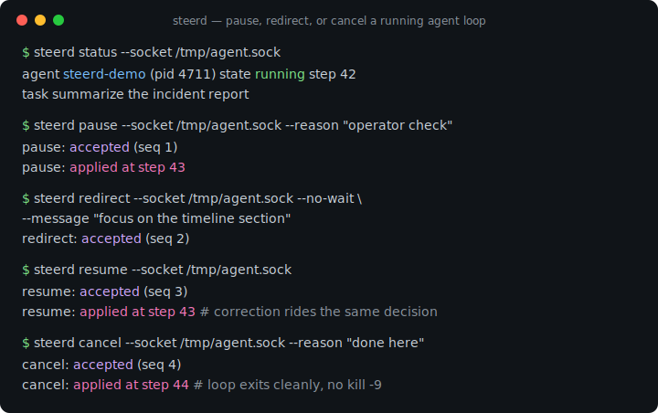
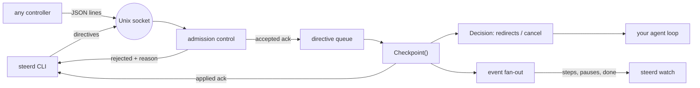

# steerd

[English](README.md) | [中文](README.zh.md) | [日本語](README.ja.md)

[](LICENSE) [](go.mod) [](CHANGELOG.md)  [](CONTRIBUTING.md)

**steerd：开源的 Unix socket 转向通道，为 agent 循环而生——在步骤间暂停一个跑偏的运行、注入纠正指令、优雅地恢复或取消，每条指令都有两阶段确认。**



```bash
git clone https://github.com/JaydenCJ/steerd && cd steerd
go build -o steerd ./cmd/steerd    # single static binary, stdlib only
```

> 预发布说明：v0.1.0 尚未发布到任何包仓库；请按上述方式从源码构建（Go ≥1.22 即可）。

## 为什么选 steerd？

当一个自主 agent 循环跑偏时——错误的分支、错误的文件、因误读指令而狂烧 token——今天的手段全都粗暴。`kill -9`（或 Ctrl-C）会摧毁运行中的状态和优雅收尾的一切可能；`SIGSTOP` 会把进程冻结在系统调用中间，socket 和文件句柄悬在半空；接管终端只有在循环恰好读 stdin 时才有用；而框架级的中断 API 只存在于那一个框架里。缺的是一个朴素、通用的控制面：让任何本地进程都能说*等一下*、*其实，换这个做法*、或者*干净地停下*——并且知道循环有没有听见。steerd 恰好就是这个，别的什么都不是：agent 嵌入一个 channel，在工作单元之间调用 `Checkpoint`；控制端拨通一个 Unix socket 发送指令；每条指令被确认两次——一次是被接纳进队列时，一次是在某个检查点生效时，并附上步骤号作为回执。它刻意**不是**一个 supervisor（从不拥有、启动或重启你的进程），也**不是**一个聊天界面（它传输控制，不传输对话）。

| | steerd | kill -9 / Ctrl-C | SIGSTOP / SIGCONT | 框架中断 API |
|---|---|---|---|---|
| 暂停落在安全点上（步骤之间） | ✅ | ❌ 摧毁状态 | ❌ 冻在系统调用中 | ✅ |
| 向运行中的循环注入纠正 | ✅ | ❌ | ❌ | 视框架而定 |
| 确认指令已生效（以及何时） | ✅ 两阶段确认 | ❌ | ❌ | 很少 |
| 带原因的优雅取消，循环自行退出 | ✅ | ❌ | ❌ | 视框架而定 |
| 适用于任何框架的任何循环 | ✅ 一个方法 | ✅ | ✅ | ❌ 仅限该框架 |
| 可被其他工具观测（状态、事件流） | ✅ | ❌ | ❌ | ❌ 内部 |
| 运行时依赖 | 0 | 0 | 0 | 该框架本身 |

<sub>依赖数核对于 2026-07-13：steerd 只导入 Go 标准库；线格式是纯 JSON 行，因此非 Go 循环用任意 socket + JSON 库即可实现 steer/1。</sub>

## 特性

- **两阶段确认** —— 每条指令都会解析为 `accepted`（已在带内入队，附接纳序号）随后 `applied`（已生效，附落地的步骤号）或 `rejected`（附原因）。没有任何东西被静默丢弃——取消和关闭时，遗留指令同样会被解析。
- **真正能停住的暂停** —— 循环阻塞在它的下一个检查点*内部*，停在作者选定的边界上，而不是信号碰巧砸中的地方。暂停期间发送的 redirect 会随恢复时循环收到的同一个决策一起送达。
- **一个方法完成集成** —— 用 `steerd.Listen` 嵌入，每个工作单元调用一次 `Checkpoint(ctx, note)`；返回的决策携带注入的指令与优雅取消。端到端约 30 行（`examples/embed/`）。
- **诚实的准入控制** —— 重复的暂停、多余的恢复、排在待取消之后的指令、队列溢出，都会立即以精确原因拒绝并返回退出码 1，且按投影状态评估，让并发控制端保持一致。
- **从外部可观测** —— `steerd status` 给出时间点快照，`steerd watch` 给出实时事件流（步骤、暂停、转向、取消），均支持文本或 JSON。
- **内置可转向的演示** —— `steerd demo` 运行一个假 agent 循环，你可以在另一个终端暂停、转向、取消它；冒烟测试和下面的 Quickstart 都是真实驱动它的。
- **零依赖、完全本地** —— 只用 Go 标准库；你机器上的一个 Unix socket，崩溃残留的陈旧 socket 会被探测并替换，永远没有网络，永远没有遥测。

## 快速上手

```bash
# terminal 1: a loop that pretends to work on a task, 200 steps
./steerd demo --socket /tmp/agent.sock --steps 200 --interval 40ms \
    --task "summarize the incident report"

# terminal 2: steer it
./steerd status   --socket /tmp/agent.sock
./steerd pause    --socket /tmp/agent.sock --reason "operator check"
./steerd redirect --socket /tmp/agent.sock --no-wait --message "focus on the timeline section"
./steerd resume   --socket /tmp/agent.sock
./steerd cancel   --socket /tmp/agent.sock --reason "done here"
```

真实捕获的输出（终端 2）：

```text
agent    steerd-demo (pid 25287)
state    running
step     9
task     summarize the incident report
note     step 9/200 collect
pending  0
pause: accepted (seq 1)
pause: applied at step 10
redirect: accepted (seq 2)
resume: accepted (seq 3)
resume: applied at step 10
cancel: accepted (seq 4)
cancel: applied at step 16
```

以及循环自己的叙述（终端 1，真实输出）——暂停期间注入的纠正，恰好随恢复它的那个决策一起到达：

```text
step 9/200 collect: summarize the incident report
redirect applied (append): "focus on the timeline section"
step 10/200 analyze: summarize the incident report; focus on the timeline section
...
cancelled at step 16/200 (reason: done here)
```

嵌入你自己的循环，每个工作单元只需一次方法调用：

```go
ch, _ := steerd.Listen("/tmp/agent.sock", steerd.Options{Agent: "my-agent", Task: "run the suites"})
defer ch.Close()
for _, item := range work {
    dec, err := ch.Checkpoint(ctx, item.Name)
    if err != nil || dec.Cancelled {
        break // stop cleanly, state intact
    }
    plan.Apply(dec.Redirects) // operator corrections, in arrival order
    item.Run()
}
```

## 确认契约

每条变更型指令都恰好按三种序列之一解析——`accepted → applied`、`accepted → rejected`（运行先结束了）、或立即 `rejected`——并且在任何单条连接上，accepted 确认一定先于 applied 确认写出。准入按*投影*状态（当前状态叠加队列回放）检查，因此并发控制端得到的答案是一致的：

| 指令 | 拒绝条件 | 原因字符串 |
|---|---|---|
| 任意 | channel 已关闭 | `channel is closed` |
| 除 `cancel` 外任意 | 取消已生效或待生效 | `agent is cancelling` |
| `cancel` | 取消已生效或待生效 | `cancel already requested` |
| 任意 | 队列已满（默认 64） | `directive queue is full` |
| `pause` | 已暂停或暂停待生效 | `agent is already paused` |
| `resume` | 未暂停且无待生效的暂停 | `agent is not paused` |

完整线格式——换行分隔 JSON 上的五种帧类型、64 KiB 帧上限、重新同步规则——见 [docs/protocol.md](docs/protocol.md)；`nc -U` 加 `jq` 就是一个可用的客户端。

## CLI 参考

`steerd <command> [flags]` —— 控制端命令需要 `--socket PATH` 或 `STEERD_SOCKET`。退出码：0 成功，1 指令被拒绝，2 用法错误，3 连接失败。

| 命令 / 标志 | 默认值 | 效果 |
|---|---|---|
| `pause` / `resume` / `cancel` | — | 发送指令，打印两个确认阶段 |
| `redirect --message S` | — | 向下一个决策注入一条指令 |
| `--mode`（redirect） | `append` | `append` 追加到当前计划，或 `replace` 替换之 |
| `--reason`（pause、cancel） | — | 随指令记录的注释 |
| `--no-wait` | 关 | `accepted` 后即返回，不等待 `applied` |
| `--timeout` | `60s` | 等待确认的上限（`0` = 永不超时） |
| `status --format text\|json` | `text` | 一次状态快照 |
| `watch --format text\|json` | `text` | 实时事件流，直到 `done` 事件 |
| `demo --steps N --interval D` | `8`、`200ms` | 运行内置的可转向演示循环 |

## 验证

本仓库不附带 CI；上面的每一条声明都由本地运行验证：

```bash
go test ./...            # 93 deterministic tests, offline, no sleeps, < 5 s
bash scripts/smoke.sh    # full steering session against the real CLI, prints SMOKE OK
```

## 架构



## 路线图

- [x] v0.1.0 —— steer/1 协议、带两阶段确认与准入控制的 channel、pause/resume/redirect/cancel/status/watch CLI、可转向演示、93 个测试 + 冒烟脚本
- [ ] `steerd wrap` —— 通过 stdio 桥接转向任意子进程的循环，无需改代码
- [ ] 回复通道：让循环在 applied 确认上附一条备注（"已上传 3/5 后暂停"）
- [ ] 指令 TTL —— 若在期限内没有检查点到来，让排队的指令过期
- [ ] 面向 Python 与 TypeScript 循环的客户端库（协议本身已语言中立）
- [ ] 面向多用户机器的可选认证 cookie

完整列表见 [open issues](https://github.com/JaydenCJ/steerd/issues)。

## 贡献

欢迎 issue、讨论与 PR——本地工作流（格式化、vet、测试、`SMOKE OK`）见 [CONTRIBUTING.md](CONTRIBUTING.md)。入门任务标注为 [good first issue](https://github.com/JaydenCJ/steerd/issues?q=is%3Aissue+is%3Aopen+label%3A%22good+first+issue%22)，设计问题在 [Discussions](https://github.com/JaydenCJ/steerd/discussions) 里讨论。

## 许可证

[MIT](LICENSE)
